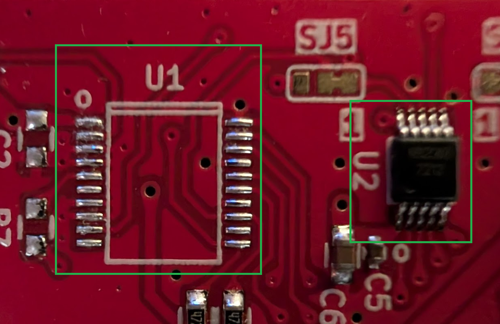

# 06 I/O Devices

Build the following special function register to connect `HACK` to I/O devices: `UART_TX`, `UART_RX`, `SPI`, `SRAM`, `GO`, `LCD` and `RTP`. For every special function register we provide a folder with implementation details and a test bench. The special function register must be memory mapped, so `HACK` can read/write data from/to the I/O device.

| address | I/O dev   | function                                           |
| ------- | --------- | -------------------------------------------------- |
| 4096    | `LED`     | 0= `LED` off, 1= `LED` on                          |
| 4097    | `BUT`     | 0= button pressed "down", 1= button released       |
| 4098    | `UART_TX` | Transmit byte to UART with 115200 baud 8N1         |
| 4099    | `UART_RX` | Receive byte from UART with 115200 baud 8N1        |
| 4100    | `SPI`     | Read/write `SPI` flash memory chip                 |
| 4101    | `SRAM_A`  | Address of external SRAM chip                      |
| 4102    | `SRAM_D`  | Read/write data from/to external SRAM chip         |
| 4103    | `GO`      | Start execution of instructions from external SRAM |
| 4104    | `LCD8`    | Write 8 bit command/data to `LCD` screen           |
| 4105    | `LCD16`   | Write 16 bit data to `LCD` screen                  |
| 4106    | `RTP`     | Read/write byte from/to `RTP` controller           |
| 4107    | `DEBUG0`  | Used for debugging                                 |
| 4108    | `DEBUG1`  | Used for debugging                                 |
| 4109    | `DEBUG2`  | Used for debugging                                 |
| 4110    | `DEBUG3`  | Used for debugging                                 |
| 4111    | `DEBUG4`  | Used for debugging                                 |

For every special function register we will need the appropriate software to talk to the device. The simpler device drivers (`UART`, `SPI`, `SRAM` and `GO`) can be implemented in assembly. After completing the devices we will be able to fill the `SRAM` chip with up to 128KB (64K words) of `HACK` code. This will enable us to run Jack OS and applications on `HACK`. The more sophisticated device drivers for `LCD` and `RTP` will be implemented in Jack.

### Proposed implementation


***

### Project

+ Copy `HACK.v` from `05_Computer_Architecture` into `06_IO_Devices` and add one I/O device at time at the designated memory mapped address. Implement the corresponding special function register and run the test bench.
  
  ```
  $ cd <0X_device>
  $ apio clean
  $ apio sim
  ```

+ Implement the designated assembler program, install the binary into `00_HACK` and run the test bench:
  
  ```
  $ cd <0X_device>
  $ make
  $ cd ../00_HACK
  $ apio clean
  $ apio sim
  ```

* Run `HACK` on real hardware on `iCE40HX1K-EVB` with the device attached:
  
  ```
  $ cd 00_HACK
  $ apio clean
  $ apio upload
  ```

* Check if attached I/O device is working according to the uploaded software.

### Resistive Touch Panel (RTP)

Later hardware revisions (Rev C onwards) of `MOD-LCD2.8RTP` may ship with different ICs for the `RTP` controller and while the overall functionality is similar the implementation is a major point of divergence. The board is currently printed to support either the `NS2009` or the `AR1021` chip. In the image below the `NS2009` chip has been installed in the `U2` slot. In other variations `AR1021` may be installed in the `U1` slot instead and earlier revisions will not include the `U2` slot at all.



Once you have identified which chip is installed comment/uncomment the relevant set from each pair.

Create symlinks to instantiate the relevant template:

```
sudo ln -s RTP_AR1021.v RTP.v
sudo ln -s 07A_RTP_AR1021 07_RTP

sudo ln -s RTP_NS2009.v RTP.v
sudo ln -s 07B_RTP_NS2009 07_RTP
```

Update `06_IO_Devices/00_HACK/HACK_tb.v` refs:

```
// AR1021 wires
// wire RTP_SDI;
// wire RTP_SDO;
// wire RTP_SCK;

// NS2009 wires
wire RTP_SDA;
wire RTP_SCL;

// ...

// AR1021 wires
// .RTP_SDI(RTP_SDI),   // RTP Serial Data In
// .RTP_SDO(RTP_SDO),   // RTP serial Data Out
// .RTP_SCK(RTP_SCK)    // RTP serial clock

// NS2009 wires
.RTP_SDA(RTP_SDA),      // RTP Data line
.RTP_SCL(RTP_SCL)       // RTP Serial Clock
```

Update `06_IO_Devices/00_HACK/iCE40HX1K-EVB.pcf` refs:

```
# AR1021 pins
# set_io RTP_SDI 19		# PIO3_8B connected to pin 29 of GPIO1, pin 4 TXD (`SDO`) on MOD-LCD2.8RTP
# set_io RTP_SDO 20		# PIO3_10A connected to pin 31 of GPIO1, pin 6 SDA (`SDI`) on MOD-LCD2.8RTP
# set_io RTP_SCK 21		# PIO3_10B connected to pin 33 of GPIO1, pin 5 SCL (`SCK`) on MOD-LCD2.8RTP

# NS2009 pins
set_io RTP_SDA 20		# PIO3_10A connected to pin 31 of GPIO1, pin 6 SDA on MOD-LCD2.8RTP
set_io RTP_SCL 21		# PIO3_10B connected to pin 33 of GPIO1, pin 5 SCL on MOD-LCD2.8RTP
```

Towards the end of the project the logic cell budget may become tight especially if implementing `I2C` for the `RTP` chip on `iCE40HX8K-EVB`. In that instance you can disable `UartTX/RX` by commenting out the relevant parts in `HACK.v` and swap debug implementation to printing to `Screen` (when complete) to reclaim some LCs if needed. An `iCE40HX8K-EVB` should have more than enough LC budget but hasn't been tested / may need other minor changes.