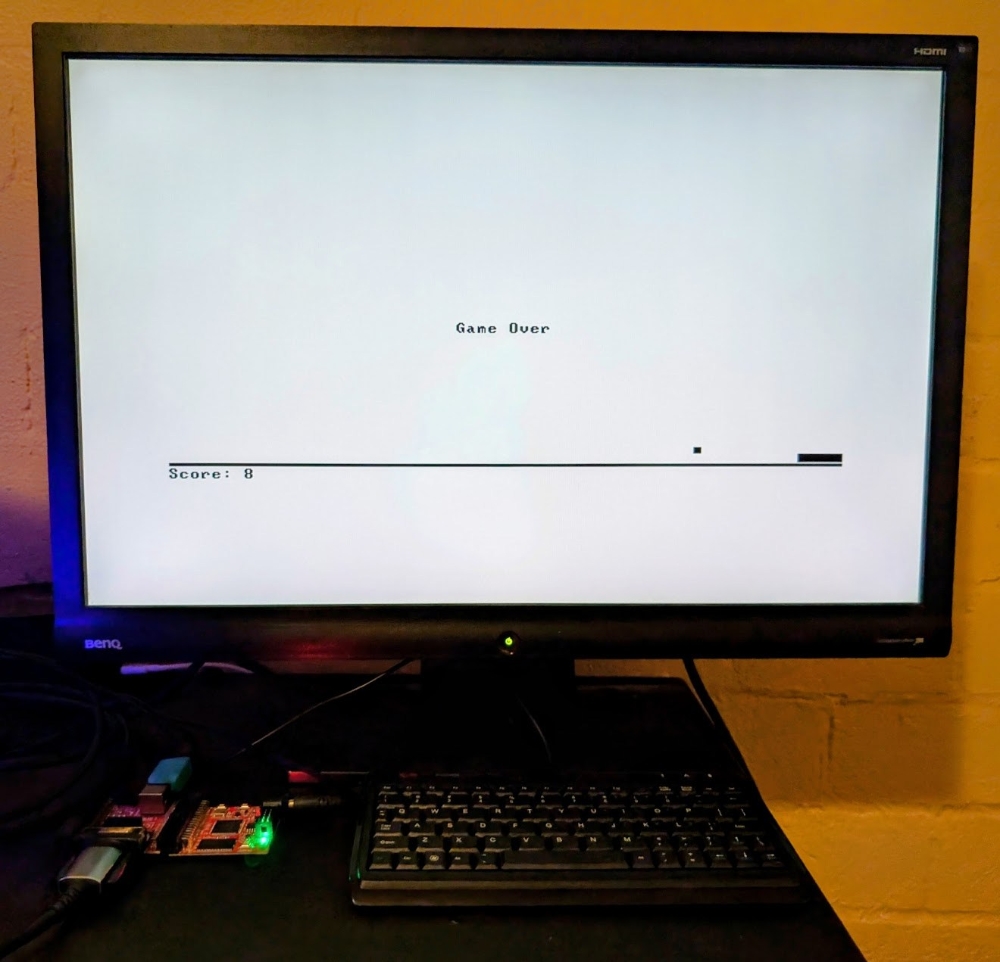

# 09 More Fun to Go!

In this section we will pivot back to a more classic `HACK` implementation using the `Keyboard` and `Screen` interfaces for I/O as described in the original nand2tetris spec. This will involve implementing `PS/2` and `VGA` controllers respectively to connect to a compatible keyboard and monitor. If still using the original `olimexino-32u4` + `iCE40HX1K-EVB` setup it can be expanded with `iCE40-IO` for `PS/2` and `VGA` ports and that will be the assumed setup in this implementation. 

Some changes will be needed to support writing pixel data to VRAM which was previously off loaded to `MOD-LCD2.8RTP` in the prior implementation, this board and the corresponding `LCD`/`RTP` controllers/drivers are no longer used.

If a part/class/test from previous `HACK` & Jack OS implementation could be carried forward then it is imported as is.

The [GateMateA1-EVB](https://www.olimex.com/Products/FPGA/GateMate/GateMateA1-EVB) board by Olimex could also be used here as seen in Michael Schröder's [hack-fpga](https://gitlab.com/x653/hack-fpga) project which is roughly comparable in cost to the sum of the parts described above but with far more FPGA resources. If you are seriously looking at doing a project like this yourself I would probably start there next time, there are significant constraints to `iCE40HX1K-EVB` which are abstracted away in more capable boards.

For keyboard I was using Adafruit's 60% hybrid USB and PS/2 [Keyboard](https://adafru.it/857) but anything with `PS/2` (directly or as fallback) should work. I happened to have an old monitor that will had a `VGA` port (sometimes also referred to as `D-sub` or `DE-15` port) but don't have any modern recommendations for that one.

These other/similar projects may be of interest for research purposes or board alternatives:

* https://gitlab.com/x653/hack-fpga
* https://github.com/giuseros/nand2tetris
* https://github.com/gunnerson/hack-fpga



## Major Changes

- Added `PS/2` and `VGA` & keyboard controllers.
  - A dedicated power supply must be used for the `PS/2` receiver to function correctly which requires 5v. If not required then powering the system with 3.3v over UEXT (i.e. via `olimexino-32u4` from USB power or otherwise) is still fine.
- Removed the `UartTX/RX`, `LCD` and `RTP` parts.
  - The `TX` pin for `olimexino-32u4` must not be set to `Output` in the sketch due to an electrical conflict with the `PS/2` receiver which indirectly connects to the same pin in shared fabric of `iCE40HX1K-EVB`.
  - If using jumper cables instead of a ribbon cable for UEXT simply disconnecting the `UART` lines should do the trick.
- The second 64KB page of `SRAM` memory is now used for heap & VRAM memory, the first `SRAM` page remains reserved for Jack application code.
  - All of the remaining `BRAM` memory can be used for stack storage.
- `SRAM_A/D` now supports multiple updates per cycle to support above: most updates are performed during `clk negedge` and expressed to CPU when it updates in `clk posedge` as normal.
  - This is a complex architectural change with significant performance implications, if you can get a board with dual port RAM to parallelize the VRAM reads I would strongly recommend it.
  - Because all these accesses to `SRAM` have to happen procedurally the `CPU` needs to be slowed down from 25 MHz to 6.25 MHz for there to be enough time to process everything, mainly allowing for signal propogation on the `SRAM` bus and the read/write cycle of SRAM itself.
- Restored all Jack classes & APIs to original nand2tetris spec where possible, some small tweaks exist to fit current architecture.

## Upload Bitstream

Non-exhaustive list of tests below, for several modules there are more specific `asm` tests for debugging but in general this should do for validation.

Build bootloader, copy into revised HACK directory & upload it (separately from remaining application code):

```
$ cd ~/src/nand2tetris-fpga/06_IO_Devices/05_GO && make && cp ../00_HACK/ROM.hack ../../09_More_Fun_to_Go/00_HACK && cd ../../09_More_Fun_to_Go/00_HACK && apio clean && apio upload
```

## Upload Application

```
$ cd ~/src/nand2tetris-fpga/09_More_Fun_to_Go/03_Pong && make && make upload
```
