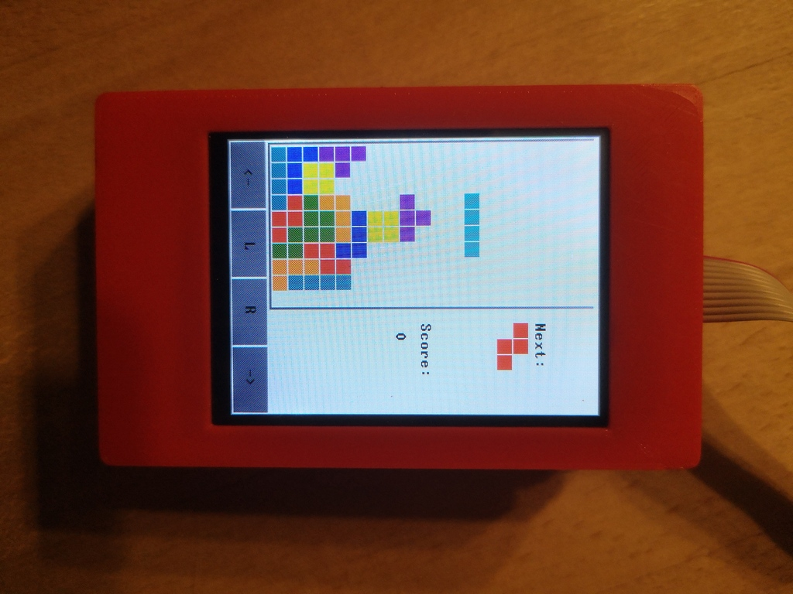

# nand2tetris-fpga (v3.0)

## Disclaimer

This is both a complete implementation & fork of Michael Schröder's [course](https://gitlab.com/x653/nand2tetris-fpga). I have made my own revisions, extensions and corrections to update it for modern tooling, current hardware revisions of the relevant boards and in general to make it a more complete & polished experience. 

Please see the [Changelog](./Changelog.md) for details.

***

> _Wouldn't it be nice to make Hack or Jack also run on some "real platform" made from some "real stuff"?_
> 
> Noam Nisan and Shimon Schocken

This project is about building HACK on real hardware as proposed in Chapter 13 of the course [nand2tetris](https://www.nand2tetris.org/) using only FOSS, free and open source hardware and software.

 

Our final implementation of `HACK` will have the following specs:

* Original CPU/ALU design of `HACK` from nand2tetris.

* Implemented on `iCE40HX1K-EVB` from Olimex.

* Clocked at 25 MHz.

* BRAM 3584 x 16 bit (R0-R15/static/stack/heap).

* SRAM 64K x 16 bit (instruction memory).

* Bootloader boots `HACK` code from flash ROM into SRAM.

* 2.8 inch color `LCD` with 320x240 pixel.

* Resistive Touch Panel (`RTP`) support.

* Powerful enough to run Tetris!
  
  

***

## Roadmap

In every project folder you find a file `Readme.md` containing specifications and implementation details.

> _This is your last chance. After this, there is no turning back. You take the blue pill - the story ends, you wake up in your bed and believe whatever you want to believe. You take the red pill - you stay in Wonderland and I show you how deep the rabbit-hole goes._
> 
> Morpheus

### [00 Prerequisites](00_Prerequisites)

Get the hardware and install the tools.

### [01 Boolean Logic](01_Boolean_Logic)

Start with a simple `Nand` gate and build the logic chips: `Not`, `Buffer`, `And`, `Or`, `Xor`, `Mux`, `DMux`, and their multi-bit versions `Not16`, `Buffer16`, `And16`, `Or16`, `Mux16`, `Or8Way`, `Mux4Way16`, `Mux8Way16`, `DMux4Way` and `DMux8Way`.

### [02 Boolean Arithmetic](02_Boolean_Arithmetic)

Implement `HalfAdder`, `FullAdder`, `Add16`, `Inc16` and the `ALU`.

### [03 Sequential Logic](03_Sequential_Logic)

Build sequential chips `Bit` , `Register` and `PC` that make use of the Data Flip Flop (`DFF`) to store the state. `DFF` is a Verilog primitive so it will not necessary to implement it. The memory chips `RAM512` and `RAM3584` are based on the BRAM primitive `RAM256`, which uses Block RAM (BRAM) structures integrated in `iCE40HX1K`. `BitShift9R` and `BitShift8L` are new chips not explained in the original nand2tetris course. They serve to connect `HACK` to different I/O devices which are connected using a serial protocol where data is transmitted bitwise.

### [04 Machine Language](04_Machine_Language)

Write two little machine language programms to run on `HACK`. The first program `leds.asm` will test I/O capability of `HACK`. Every time the user presses the buttons `BUT1/2` on the `iCE40HX1K-EVB` board  the `LED` will change accordingly. With the second program `mult.asm` we will calculate the product of two numbers to test the arithmetic capabilities of the `CPU`/`ALU`.

### [05 Computer Architecture](05_Computer_Architecture)

Build `HACK` computer system consisting of the chips `CPU`, `Memory`, `Clock25_Reset20`, RAM and `ROM`. `ROM` uses a BRAM structure (512 bytes / 256 words) of `iCE40HX1K` and can be considered primitive. It can be preloaded with the instructions of the assembler programs implemented in `04_Machine_Language` .

### [06 I/O Devices](06_IO_Devices)

We will expand `HACK` computer platform by adding chips to handle communication to I/O devices, which we connect to `HACK`.

* `UART` communicates with 115200 baud 8N1 to computer.
* `SPI` reads the 2MB flash memory on `iCE40HX1K-EVB`.
* `SRAM` writes data to the external SRAM chip.
* `GO` enables booting Jack OS software.
* `LCD` connects a little color screen with 320x240 resolution.
* `RTP` connects the touch panel.

### [07 Operating System](07_Operating_System)

Implement the operating system Jack OS, written in the high level language Jack consisting of the classes `GPIO.jack`, `UART.jack`, `Memory.jack`, `Math.jack`, `Array.jack`, `String.jack`, `Screen.jack`, `Output.jack`, `Touch.jack` and `Sys.jack`

Finally you can compile and run Tetris!

### [08 3D Printer](08_3D_Printer)

We provide construction files to print a little case and development jig for your `HACK` computer with a 3D printer.

## Credits

* Michael Schröder (mi.schroeder@netcologne.de), the original author of this course. Without them first demonstrating the art of the possible I am unlikely to have ever started.

* Noam Nisan and Shimon Schocken, "The Elements of Computing Systems", MIT Press. Visit [nand2tetris](https://nand2tetris.org) and learn to build a modern general purpose computer system from first principles.

* [Olimex Ltd](https://www.olimex.com/): Buy your hardware from the Company with highest number of registered OSHW projects :)

* Wolf Clifford: The master of open source FPGA with iCE40 and [Project IceStorm](http://www.clifford.at/icestorm/).

* Jesús Arroyo Torrens, Juan González (Obijuan): Open source ecosystem for open FPGA boards [APIO](https://github.com/FPGAwars/apio).

* Juan González-Gomez (Obijuan): Lern verilog with [open-fpga-verilog-tutorial](https://github.com/Obijuan/open-fpga-verilog-tutorial/).

* Icons made by <a href="https://www.flaticon.com/free-icon/cpu_483131?term=cpu&page=3&position=86" title="Those Icons">Those Icons</a> from <a href="https://www.flaticon.com/" title="Flaticon"> www.flaticon.com</a>